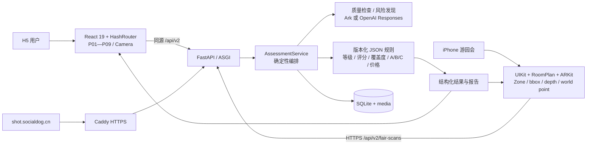
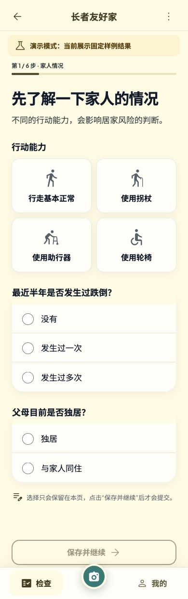
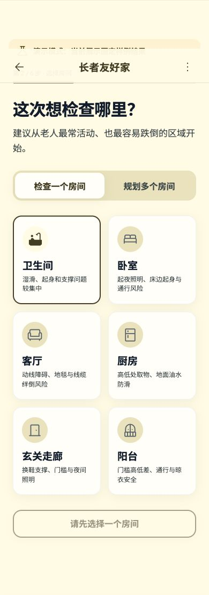
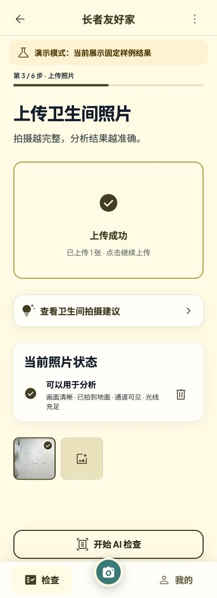
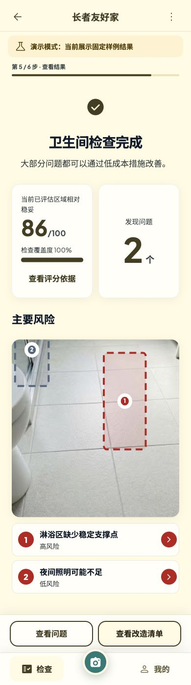
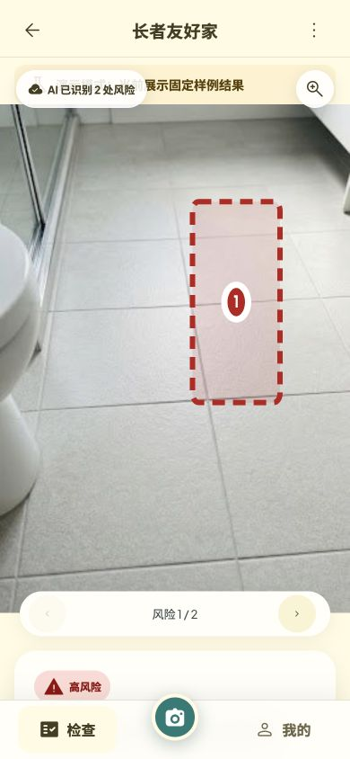
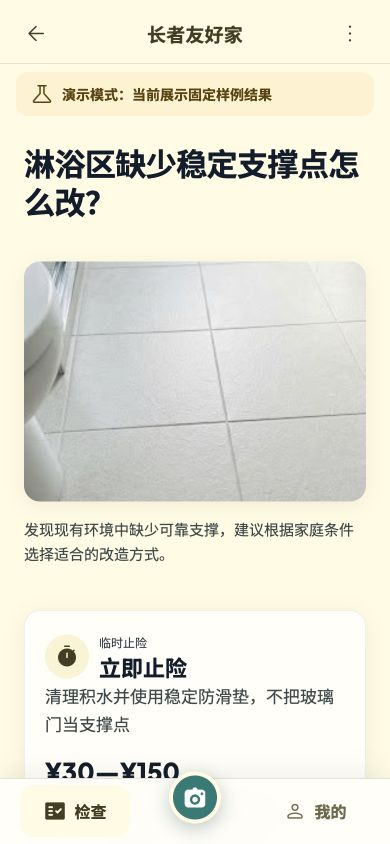
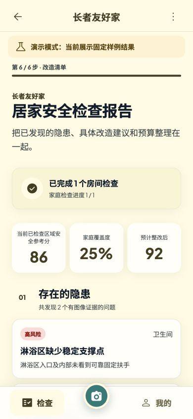
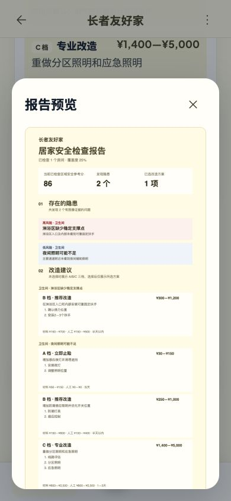
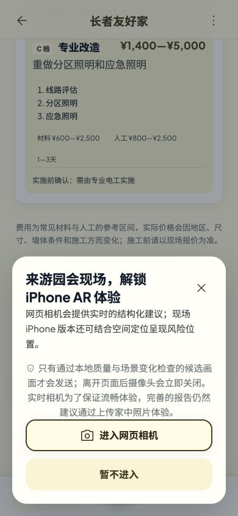

# 全国总决赛代码与产品交付审查

> **2026-08-07 范围变更：**本文保留为历史审查快照。文中游园会、Zone、`fair-scans`、Turbo/Pro 原生报告链路均已退出产品并从代码移除；当前 iOS 是在线 H5 容器，原生仅提供家庭房间单张拍照与实时空间/二维扫描。当前状态以 `README.md` 和 `docs/IMPLEMENTATION_STATUS.md` 为准。

> 审查日期：2026-08-04
> 审查分支：`feat/anjushouhu-mvp`
> 审查提交：`eb2d909130af26f53154424626986af095a3f474`
> 审查范围：父目录 `PRD.md`、`AGENTS.md`，RASSAR 全部 H5、FastAPI、规则、Provider、iOS/ARKit、测试、部署文件与公网版本。
> 重要边界：本次仅审查和生成文档，没有修改业务代码；页面主链路使用本地显式 `ANJU_MOCK_ANALYSIS=1` fixture 验证。公网只验证静态构建、HTTPS、路由与 `/health`，**没有在本轮调用真实模型，也没有完成真机/授权场景效果评测**。

## 1. 执行摘要

项目已经不是概念 Demo：照片 P01—P09、确定性评分、覆盖度、A/B/C 规则价、长图报告、H5 相机、FastAPI/SQLite、iOS RoomPlan/ARKit 均有真实实现，自动测试与 iOS 无签名构建全部通过，公网 H5 与当前构建一致。仓库虽保留视频抽帧兼容代码，但 2026-08-06 已确定不做、不开放、不宣传。当前最适合总决赛的是“照片上传 → 风险框 → 可解释评分 → B 档方案 → 预算报告”链路。

但离“现场稳”仍有明显缺口：无定位证据的候选仍可能进入正式计分；多照片/实时连续帧无法可靠按物理风险去重；上传质量检查与正式分析共用单 Pro 通道，且一次临时 Provider 失败会把正常照片永久判为不可用；iOS 当前不是文档目标中的 Turbo + Pro 正式复核，且没有 LiDAR 真机连续验证。结果永久 Loading、任务幂等与重启恢复已在后续 P0-A 修复。结论是：**不需要大重构，应继续完成小范围、核心链路优先的可靠性收口。**

## 2. 当前真实架构



### 2.1 职责边界判断

- 模型负责质量判断、可见风险候选、证据、置信度和区域，见 `backend/app/providers/vision.py:181-274`。
- 本地规则负责等级、扣分、覆盖度、方案和价格，见 `backend/app/rules.py:16-90`、`backend/app/scoring.py:47-75` 与 `backend/rules/*.json`。
- 前端只消费结构化结果并渲染 SVG/Canvas，没有执行模型生成的 HTML/SVG。
- `AssessmentService` 是事实上的确定性 Agent/编排器；当前不需要引入自主 Agent 框架。
- SQLite 单进程 + 同源 H5 对黑客松部署合适；在存储迁移前不要扩多 worker/多副本。

## 3. 当前真实用户旅程

### 3.1 H5 P01—P09

| 步骤 | 用户看到与执行 | 输入 | 系统输出与下一步 | 状态 |
|---|---|---|---|---|
| P01 首页 | 价值主张、示例风险图；照片与实时相机入口 | 选择入口 | 照片入口创建 `photo` assessment 后进 P02；另一入口打开实时相机弹窗 | 照片已完成；不提供本地视频文件分析 |
| P02 家人情况 | 选择行动能力、跌倒史、居住状态 | 3 组必填枚举 | `PUT /profile` 后进入 P03；未填完按钮禁用 | 已完成；缺 PRD“腿脚不太方便”选项 |
| P03 房间选择 | 单房间/多房间，6 类房间卡 | 房间类型/计划 | 保存 planned rooms、创建 room，进入 P04 | 已完成 |
| P04 上传与质量 | 拍照/相册、拍摄建议、缩略图、质量状态 | 1—6 张 JPEG/PNG/WebP | 浏览器转 JPEG/缩放，逐张上传并同步质量检查；有 usable media 才能进 P05 | 照片已完成；HEIC/多图时延待验 |
| P05 分析中 | 进度、已识别要素、退出等待、重试 | room/media | `POST :analyze` + 1.2 秒轮询；completed 后进入 P06 | 部分完成；视觉进度主要按固定时间 |
| P06 结果 | 分数、覆盖度、风险数、证据图、SVG | room result | 点击风险进入 P07，点击清单进入 P09 | 主路径完成；错误时永久 Loading |
| P07 风险详情 | 当前风险框、证据、扣分、前后切换 | risk id | 点击“查看解决方案”进入 P08 | 部分完成；反馈/重圈后端有、H5 无入口 |
| P08 A/B/C | 三档方案、价格构成、工期、施工、限制 | 选择/移除 solution id | 选择写后端；看下一风险或进入 P09 | 已完成；单卡预计提升展示不完整 |
| P09 报告 | 已检查区域分、家庭覆盖度、预计分、隐患、预算、长图预览 | selected solutions | 预览/保存/系统分享图片；可继续其他房间 | 主路径完成；未选风险 A/B/C 混入正文 |
| 只读分享链接 | 当前 H5 无入口 | share token | 后端可返回报告，但 `/#/share/{token}` 被通配路由送回首页 | 后端完成、前端未完成 |
| 整改后复查 | 没有页面或 API | 新照片/旧风险映射 | 无 | 未完成 |

### 3.2 页面证据

以下截图来自本地显式 Demo Provider、390×844 移动视口，素材为仓库 fixture，不代表真实模型效果。

| 首页 | 家人情况 |
|---|---|
|  |  |

| 房间选择 | 上传质量 |
|---|---|
|  |  |

| 结果总览 | 风险位置 |
|---|---|
|  |  |

| A/B/C | 报告 |
|---|---|
|  |  |

| 报告长图预览 | 实时相机入口 |
|---|---|
|  |  |

### 3.3 iOS 游园会真实链路

```text
首页 → Zone 准备 → RoomPlan/ARKit 扫描
→ 本地亮度/清晰度/位移/旋转门控
→ 远端 Turbo 关键帧候选
→ bbox 映射到历史深度/世界坐标（可靠时）
→ 服务端按 risk_code 确定性归并
→ 本地规则等级/评分/A/B/C/报告
```

代码路径存在且能编译，但 `docs/DEVICE_TEST_RECORD.md` 明确写着“当前状态：尚未执行”。此外，服务端 finalize 目前由 `_direct_fair_reviews()` 按 `risk_code` 直接归并，并未调用目标架构里的 Pro `CandidateReviewSkill`；因此不能把现状宣传为“Turbo + Pro 已完成正式复核”。

## 4. 架构与工程评分

| 维度 | 评分 | 判断 |
|---|---:|---|
| 前端架构 | 6/10 | React/TypeScript/HashRouter、集中 API 和基础 Store 合理；`App.tsx` 1214 行，页面、轮询与报告 Canvas 耦合，结果错误判断有实质缺陷 |
| 后端架构 | 7/10 | ASGI、Service、Repository、Rules、Provider 已分层；`AssessmentService` 970 行偏重，job 生命周期和容量等待不完整 |
| AI 调用层 | 7/10 | 严格 JSON Schema、服务端密钥、模型/规则职责正确；prompt 硬编码、真实效果未评测、iOS Pro review 缺失 |
| 数据模型 | 7/10 | v2 assessment/profile/room/media/risk/solution/report 较完整；缺 `RiskEvidenceGroup`、`ReassessmentResult` 与正式 review 状态 |
| 文件处理 | 6/10 | 图片转 JPEG/缩放、Blob URL 清理和服务端体积/签名校验较扎实；HEIC/旋转/大图仍待真机，多图逐张质量调用太慢；遗留视频代码不纳入评分 |
| 部署 | 7/10 | Docker/Caddy/Compose、非 root、只读容器、HTTPS 和单 worker 方向正确；深度 Provider smoke、回滚自动化、无 hash asset 缓存需补 |
| 测试 | 8/10 | 55 Python + 30 React + 21 Swift 全通过，typecheck/build/iOS build 通过；缺真实浏览器 E2E、真实 Provider 指标和真机矩阵 |
| 现场演示稳定性 | 6/10 | 显式 Demo 链路顺畅；真实 Provider、弱网、多人并发与 iOS 真机未闭环 |
| 评委体验 | 7/10 | 风险框、可解释分、A/B/C、预算长图有记忆点；入口与报告歧义会削弱可信度 |

## 5. 是否需要重构

### 5.1 结论

**需要“小范围核心重构”，不需要大规模重写。** 总决赛前的目标应是让一条最强链路可重复、可降级、可解释，而不是重做技术栈。

### 5.2 必须在总决赛前重构

1. **分析任务生命周期**：`start_analysis()` 增加 room 级幂等、活动 job 复用、全异常兜底、超时/中断状态恢复；启动恢复时同步把关联 room 从 `analyzing` 迁移到可重试失败态。
2. **证据与去重**：正式风险没有区域/引用证据时降级为不计分待确认；在评分前形成 canonical risk，而不是只按 `(risk_code, media_id)`。
3. **Provider 容量预算与质量状态**：上传质量检查与正式分析拆开容量策略，Pro 排队要有超时和明确错误；模型超时属于可重试系统失败，不能持久化成“图片质量不合格”；H5 fetch 需要请求预算。
4. **iOS 候选复核语义**：要么补真实 Pro review，要么把当前链路明确标记为 Turbo 待确认，不得计为“已 Pro 复核”。

### 5.3 建议在 P0 稳定后小步整理

- 将 `frontend/src/App.tsx` 按页面/领域 hook 拆分：`pages/`、`hooks/useAnalysisJob.ts`、`report/renderReport.ts`；保持视觉和 API 不变。
- 把 Provider prompt 从方法内字符串迁到版本化模板文件，Schema 与 prompt version 成对测试。
- 把报告长图改为可分页/分片渲染，计算真实文本高度并设置安全尺寸上限。
- 将 `AssessmentService` 的 analysis job、media quality、fair review 拆为内部用例类；无需引入新框架。

### 5.4 建议保持不动

- React + Vite + HashRouter；HashRouter 对当前单容器静态部署有利。
- FastAPI + SQLite + 单 worker；黑客松阶段足够稳定、成本低。
- JSON 版本化规则、Python `Decimal` 评分、价格预算组去重。
- 同源 H5/API 与 Caddy 两域名兼容拓扑。
- 显式 Mock、正式失败不回退 Demo 的边界。

### 5.5 决赛后再做

- PostgreSQL/对象存储/多副本扩容。
- 整改前后复查模型、按城市价格、PDF、家庭协作、商品/施工服务。
- 完整 Agent/Skill 框架、向量库或通用工作流引擎。

## 6. 缺陷与风险清单

### Blocker

#### BLK-01 — iOS 正式复核与真机证据缺失

- **位置**：`backend/app/assessment_service.py:487-505, 540, 616-659`；`RASSAR App/AnjuGuard/RemoteAnalysisClient.swift:72-107`；`docs/DEVICE_TEST_RECORD.md:1-17`。
- **触发条件**：把 iPhone 游园会 AR 作为总决赛核心现场能力。
- **用户表现**：同一 `risk_code` 的不同物理风险可能被合并；Turbo 候选会被当成正式结果；旋转、深度、锚点、弱网或内存问题可能只在真机出现。
- **根因**：`_direct_fair_reviews()` 只按风险代码分组；没有真实 Pro review；设备测试记录为空。
- **修复建议**：3 天内至少做到“Turbo 候选 → 空间/证据归并 → Pro 确认/拒绝/合并/修正 → 规则评分”；做不到则所有未复核候选显示“待确认且不计分”，并把 iOS 改为增强演示而非主链路。
- **影响**：严重影响模型可信度和现场稳定性。
- **决赛前必须修复**：是；或明确降级演示定位。

### P0

#### P0-01 — H5 本地视频关键帧能力已按范围决策关闭

- **位置**：`frontend/src/App.tsx:406-411, 652-659`；`frontend/src/content.ts:26`。
- **产品决定**：2026-08-06 确定不做本地视频选择、自动关键帧截取和视频帧正式识别。
- **当前处理**：`video.ts`、`video_frame` DTO、媒体来源字段和兼容测试可保留，但默认关闭、无用户入口、不进入演示和效果口径。
- **入口要求**：首页只提供照片正式评估和 H5 实时相机临时建议；不得把实时相机描述成本地视频分析。
- **决赛前必须修复**：无需开发视频功能；只需验证范围和文案一致。

#### P0-02 — 结果接口失败会永久显示 Loading，错误页不可达

- **位置**：`frontend/src/App.tsx:779-801`，`ResultPage()`。
- **触发条件**：`GET .../result` 断网、超时、401/404/500。
- **用户表现**：一直显示“正在准备检查结果…”，没有失败说明或重试按钮。
- **根因**：先判断 `!result` 返回 Loading，再判断 `error`。
- **修复建议**：错误判断必须在 `!result` 之前；补断网/超时/会话过期组件测试。
- **影响**：最关键“揭晓结果”节点无法恢复。
- **决赛前必须修复**：是；预计 0.25 天。

#### P0-03 — 分析任务非幂等，异常/重启会留下不一致状态

- **位置**：`backend/app/assessment_service.py:58, 196-210, 724-795`。
- **触发条件**：重复点击/重试 `:analyze`；`_analyze()` 出现 `TypeError`、`KeyError`、SQLite/IO 等非白名单异常；或分析中重启应用。
- **用户表现**：重复模型扣费、状态互相覆盖、分析页永远等待；重启后 job 已是 `interrupted`，但 room 仍可能保持 `analyzing`。
- **根因**：每次调用都新建 job；executor future 未观察；只捕获 `ProviderError/AssessmentError/ValueError`；服务初始化只更新 `jobs`，没有同步恢复关联 `rooms`。
- **修复建议**：同 room 只允许一个 queued/running job并返回现有 job；worker 最外层捕获未知异常并安全记录 `analysis_failed`；启动恢复在同一事务中把中断 job 与关联 room/assessment 迁移到可重试状态。
- **影响**：现场恢复能力与费用都受影响。
- **决赛前必须修复**：是；预计 1 天。

#### P0-04 — 无可追溯区域的候选仍可进入正式计分

- **位置**：`backend/app/providers/vision.py:193-203`；`backend/app/assessment_service.py:930-949, 724-787`。
- **触发条件**：模型返回 `region=null`，或区域校验失败。
- **用户表现**：结果出现有扣分但没有可核对位置的正式风险，只能看到“位置待确认”。
- **根因**：Prompt 明确允许 null；校验器把坏区域改为 `None` 后仍 `accepted.append(item)`；后续照常落库和评分。
- **修复建议**：没有 bbox/polygon 的候选必须 `state=pending_manual_check` 且 `score_eligible=false`，或直接拒绝；增加 schema/服务测试。
- **影响**：违反证据优先原则，是评委追问“为什么扣分”的可信度风险。
- **决赛前必须修复**：是；预计 0.5—1 天。

#### P0-05 — 多照片/连续帧对同一物理风险可能重复扣分

- **位置**：`backend/app/assessment_service.py:736-746, 866-902`；`backend/app/scoring.py:47-58`。
- **触发条件**：同一风险在两张普通照片中出现，或相机移动导致 bbox 在不同帧中不重叠。
- **用户表现**：风险数和扣分被放大。
- **根因**：普通照片没有 `source_id`，跨帧合并直接失败；帧间 bbox 使用不同相机坐标，IoU 不可靠；评分只按 `(risk_code, media_id)` 去重。
- **修复建议**：引入最小 `RiskEvidenceGroup/canonical_risk_id`；图片用来源、视觉相似、语义/区域和用户确认保守归并；不确定时待确认但不要自动重复扣分。
- **影响**：多照片、H5 实时相机和 iPhone 相机帧的核心可信度。
- **决赛前必须修复**：是；预计 1—2 天。

#### P0-06 — 单 Pro 通道串行质量检查，真实现场延迟不可控

- **位置**：`backend/app/assessment_service.py:143-181, 358-382, 724-733`；`frontend/src/App.tsx:587-605`；`frontend/src/api.ts:18-37`。
- **触发条件**：上传 3—6 张照片、两名评委同时体验、Provider 慢/超时。
- **用户表现**：前端逐张等待质量模型；第二个用户无界排队；浏览器 fetch 没有请求超时。
- **根因**：每张上传同步做 Pro quality；前端串行；Pro semaphore 排队没有最大等待时间；质量调用最多两次、单次可到 60 秒。
- **修复建议**：质量初筛优先本地/轻量模型并批处理；Pro 队列加等待上限和 `Retry-After`；正式分析保持单并发；H5 统一 AbortController 时间预算和可恢复文案。
- **影响**：直接决定“第一结果时间”和现场吞吐。
- **决赛前必须修复**：是；预计 1—2 天。

#### P0-07 — 质量模型临时失败会把正常照片永久判为不可用

- **位置**：`backend/app/assessment_service.py:168-202`。
- **触发条件**：上传已写盘后，Provider 出现 timeout、429、网络抖动或临时拒绝。
- **用户表现**：照片缩略图会长期显示不可用；之后即使网络恢复，`start_analysis()` 仍报 `no_usable_media`，用户只能删除并重新上传同一照片。
- **根因**：`ProviderError` 被序列化进 `quality_json`，同时写死 `usable=false`；没有 `quality_checking/quality_failed_retryable` 状态和重新质检入口，系统把“模型没判断成功”混同为“图片确实不合格”。
- **修复建议**：优先把上传改成“文件保存成功后立即返回，质量检查异步更新”；最小方案也要保存独立 `quality_status` 与错误类型，提供幂等重新质检。只有成功的质量结果才能判定清晰/暗光/遮挡，系统失败不得覆盖媒体事实。
- **影响**：弱网和现场配额波动会直接阻断照片主链路，并造成不必要的重复上传与模型调用。
- **决赛前必须修复**：是；可与 P0-06 合并实施，预计增加 0.5—1 天。

### P1

#### P1-01 — H5 缺少风险否认、已整改和位置修正闭环

- **位置**：API 已有 `frontend/src/api.ts:86-87`，但 UI 在 `frontend/src/App.tsx:823, 848` 固定 `drawing={false}`、空 `onRegionChange`。
- **触发条件**：AI 判断错误或框偏移。
- **用户表现**：只能查看解决方案，无法告诉系统“不是风险/位置不准/已经整改”。
- **根因**：后端能力未接入 P07。
- **修复建议**：先做三个明确按钮 + 一次重圈保存，不做复杂画图编辑器；反馈后刷新分数与报告。
- **影响**：产品缺少纠错和信任建立机制，也是 PRD P0 验收项。
- **决赛前必须修复**：建议是；预计 1 天。

#### P1-02 — 报告把未选风险的 A/B/C 全部展示，预算语义含混

- **位置**：`backend/app/assessment_service.py:277-315`；`frontend/src/App.tsx:995-1084`。
- **触发条件**：只为部分风险选择方案后生成报告。
- **用户表现**：顶部显示“已选 1 项/预计整改后 92”，正文却把另一风险的 A/B/C 三档全部列出；评委容易以为都计入预算或都已选择。
- **根因**：report 的 `recommendations` 对所有风险返回所有方案；长图函数对未选风险展示全部方案。
- **修复建议**：正式“整改清单”只展示 selected items；未选风险放“待选择建议”独立区，不参与预算/预计分；明确预算总计、材料、人工。
- **影响**：报告可信度与分享可读性。
- **决赛前必须修复**：是；预计 0.5—1 天。

#### P1-03 — 长图 Canvas 无分页和尺寸上限，iOS Safari 可能生成失败

- **位置**：`frontend/src/App.tsx:995-1084`。
- **触发条件**：多房间、多风险、多个未选 A/B/C、长文案。
- **用户表现**：预览空白、`toBlob` 返回 null、页面重载或内容重叠/裁切。
- **根因**：单 Canvas 高度按估算累加；没有平台上限、分页、分片；风险卡高度固定 150，未按换行文本调整。
- **修复建议**：总决赛前限制分享报告为“已选方案 + 最高优先级风险”；设置安全最大高度；超出时分页或生成多张图。
- **影响**：最强分享记忆点在大报告时不稳定。
- **决赛前必须修复**：建议是；预计 1 天。

#### P1-04 — 后端分享 token 可创建，但 H5 分享链接无路由

- **位置**：`backend/app/assessment_service.py:319-332` 返回 `/#/share/{token}`；`frontend/src/App.tsx:149-162` 没有 `/share/:token`；`frontend/src/api.ts` 没有 share 方法。
- **触发条件**：任何客户端创建后端分享链接并打开。
- **用户表现**：通配路由重定向首页。
- **根因**：兼容 API 与 H5 路由脱节。
- **修复建议**：若决赛只做图片分享，明确废弃 link CTA；若需要链接，补只读 SharePage 和过期态，不包含原图/内部日志。
- **影响**：容易在问答或联调时暴露“接口有、产品不可用”。
- **决赛前必须修复**：按演示脚本决定；0.5—1 天。

#### P1-05 — 分析轮询可重叠，前端进度主要是固定计时

- **位置**：`frontend/src/App.tsx:691-750`。
- **触发条件**：状态接口响应超过 1.2 秒或真实分析超过约 5 秒。
- **用户表现**：请求重叠、旧响应覆盖新状态；UI 很快到 95% 而后台仍处在前序阶段。
- **根因**：`setInterval` 不等待上一请求；`visualStage` 每 850ms 前进而不是绑定服务端 stage。
- **修复建议**：改为 await 完成后的递归 `setTimeout`；用服务端 stage 驱动主要步骤，只用时间估计补充，不伪造完成比例。
- **影响**：等待页可信度和弱网稳定性。
- **决赛前必须修复**：建议是；预计 0.5 天。

#### P1-06 — iOS Zone 读取存在跨 await 竞态，且文案把 Turbo 写成 Pro

- **位置**：`RASSAR App/AnjuGuard/RemoteAnalysisClient.swift:58, 72-106, 124-125`；`backend/app/assessment_service.py:487`。
- **触发条件**：关键帧请求在途时切换 Zone；或评委查看日志/架构说明。
- **用户表现**：旧 Zone 的合法响应被当作非法，`scannedZones` 记录错误；实现宣称与实际模型不一致。
- **根因**：请求前后都读取可变 `selectedZone`；Turbo provider 却占用 `pro` lane；日志仍写 “Direct Pro”。
- **修复建议**：请求开始时捕获不可变 `requestZone`；校验和写入都用它；fair analyze 使用 turbo lane；统一产品与日志为 Turbo discovery / Pro review。
- **影响**：四 Zone 演示稳定性和技术可信度。
- **决赛前必须修复**：是；预计 0.5—1 天。

#### P1-07 — `/health` 只证明密钥存在，不证明模型可用

- **位置**：`backend/app/asgi.py:119-131`。
- **触发条件**：密钥过期、模型 ID 错误、配额耗尽、供应商网络失败。
- **用户表现**：`/health` 仍返回 `analysis=ark`，直到正式上传/分析才失败。
- **根因**：健康状态只读环境变量。
- **修复建议**：保持外部 `/health` 轻量；新增受保护的 deploy smoke 或启动时缓存的 provider probe，记录最后成功时间，不在每次健康检查消耗模型额度。
- **影响**：上线前门禁可能误判。
- **决赛前必须修复**：建议是；预计 0.5 天。

#### P1-08 — iPhone HEIC 与旋转照片支持仍是“代码推测”，非真机结论

- **位置**：`frontend/src/App.tsx:660, 663` 只 accept JPEG/PNG/WebP；`frontend/src/image.ts:1-32` 尝试读取方向并转 JPEG。
- **触发条件**：iOS Safari 相册返回 HEIC/高分辨率旋转图。
- **用户表现**：可能不可选择、解码失败、方向或 bbox 对不上。
- **根因**：文件选择白名单不含 HEIC，且没有真机测试记录；Safari 是否转码受系统版本/来源影响。
- **修复建议**：不要仅凭 `createImageBitmap` 宣称支持；在目标 iPhone 上测试 HEIC、右旋、左旋、前置相机和超大图，失败时提示系统截图/转 JPEG。
- **影响**：照片主入口的真实设备兼容性。
- **决赛前必须修复**：必须验证，代码是否修改以测试结果为准。

#### P1-09 — 状态文档存在时序矛盾

- **位置**：`docs/IMPLEMENTATION_STATUS.md`、`docs/CAMERA_UPGRADE_ROADMAP.md`、`RASSAR App/AnjuGuard/RemoteAnalysisClient.swift`。
- **触发条件**：评委或队友按文档追问“为何仍有视频兼容代码、Pro 复核、是否已部署”。
- **用户表现**：如果材料未明确视频能力已取消，遗留 `video_frame` 代码容易被误认为正式入口；部分段落还可能同时写“已部署”和“工作区未部署”。
- **根因**：长文档按日期追加，缺少唯一 current-state 表。
- **修复建议**：用一个 1 页 `CURRENT_RELEASE_STATUS.md` 或更新实现状态首屏，标明 commit、生产 SHA、真实/Mock、已验证/未验证、演示脚本。
- **影响**：答辩口径不一致。
- **决赛前必须修复**：是；预计 0.5 天。

#### P1-10 — H5 相机达到 30 次调用预算后静默停止

- **位置**：`frontend/src/App.tsx:292-299`，`CameraPage()`。
- **触发条件**：长时间停留在实时相机页并累计 30 次实际模型调用。
- **用户表现**：画面仍在继续、页面没有完成或限额提示，但临时建议不再更新，用户会误以为 AI 卡住。
- **根因**：`calls >= 30` 直接 `return`，请求预算是隐藏实现细节，没有映射为可见状态。
- **修复建议**：把预算剩余量和结束原因纳入相机会话状态；达到上限后停止候选循环，显示“本次环境提示已完成”，提供“保存代表帧进入正式检查/结束/明确重新开始”三种确定性操作。
- **影响**：长会话与评委反复试用时的可理解性和费用边界。
- **决赛前必须修复**：建议是；预计 0.25—0.5 天。

### P2

#### P2-01 — Provider prompt 硬编码在方法体中

- **位置**：`backend/app/providers/vision.py:181-274`。
- **触发条件**：调 prompt、回滚或对比模型效果。
- **用户表现**：无直接 UI 症状，但版本审计、A/B 与回滚困难。
- **根因**：prompt 文本、场景边界、schema 组装混在 Provider。
- **修复建议**：迁入版本化模板，保留现有输出 schema 和模型选择；无需引入通用 prompt 平台。
- **影响**：模型迭代效率与可观测性。
- **决赛前必须修复**：否。

#### P2-02 — 静态资源缓存策略对无 hash 的图片也设置 immutable

- **位置**：`backend/app/asgi.py` 的 `/assets/` 缓存头；`frontend/public/assets/*` 有稳定文件名。
- **触发条件**：同名替换示例图、SVG 或拍摄指南后发布。
- **用户表现**：部分设备继续看到旧图。
- **根因**：所有 `/assets/` 一刀切一年 immutable；Vite JS/CSS 有 hash，但 public asset 没有。
- **修复建议**：public asset 文件名版本化，或只对带 hash 的构建资源 immutable。
- **影响**：临近比赛换素材时容易“服务器已更新、手机没更新”。
- **决赛前必须修复**：若还会换素材则是；否则可延后。

#### P2-03 — 受保护原图跨页面反复下载，弱网与内存成本可避免

- **位置**：`frontend/src/hooks.ts:4-23`；`backend/app/asgi.py:445-448`。
- **触发条件**：同一 media 在上传页、结果页、风险详情和方案页反复挂载；或在多条风险之间来回切换。
- **用户表现**：同一张图多次请求和解码，弱网下风险图再次出现 loading，大图时增加流量、内存抖动和 Safari 压力。
- **根因**：`useProtectedImage()` 每次挂载都重新 fetch/createObjectURL，卸载即 revoke；服务端正确使用 `no-store` 保护私有媒体，但前端会话内没有受控复用层。
- **修复建议**：保留服务端 `no-store`，仅在已授权 assessment 会话内建立小型、带引用计数/TTL 的 Blob URL 缓存；会话删除、token 失效或退出时统一 revoke，不做跨用户或持久化缓存。
- **影响**：不是功能阻断，但会放大移动弱网和多风险浏览时延。
- **决赛前必须修复**：否；若 Safari profiling 显示明显重复下载，可作为 P1 小修。

## 7. AI 能力拆分评估

| 能力 | 当前实现 | 应放 Prompt | 应抽成 Skill | 应写成规则 | 应由 Agent 编排 | 应由普通代码完成 | 建议 |
|---|---|:---:|:---:|:---:|:---:|:---:|---|
| 风险识别 | Ark/OpenAI 严格 schema | 是 | `RiskDetectionSkill` | 白名单/排除条件 | 调用、重试、审计 | DTO 校验 | 保持模型只报告可见候选，补授权评测 |
| 风险去重 | source/time/IoU + `(risk_code, media_id)` | 可给合并线索 | `RiskNormalizationSkill` | 合并阈值/待确认策略 | 在评分前执行 | canonical evidence graph | 当前不足，必须形成物理风险证据组 |
| 风险等级 | JSON `default_severity` | 否 | 否 | 是 | 读取版本 | 展示 | 保持现状，模型不得改等级 |
| 安全评分 | Python `Decimal` | 否 | 可封装纯函数 | 是 | 收集合格风险后调用 | 计算/格式化 | 保持确定性；无证据候选不计分 |
| A/B/C | 版本化 solution JSON | 只可解释 | `RecommendationSkill` 仅匹配/解释 | 是 | 组织当前风险与档案 | 卡片渲染 | 当前结构好，不让模型自由新增方案 |
| 改造成本 | PriceRule + budget group | 只可通俗解释 | `PriceExplanationSkill` | 是 | 汇总选择 | 整数求和/去重 | 保持规则价，修报告口径 |
| 图片标注坐标 | 模型 bbox/polygon | 是，要求归一化 | `RegionGroundingSkill` | 合法性/证据门禁 | 管理待确认/重圈 | 坐标变换 | region null 必须待确认不计分 |
| SVG 覆盖层 | React `RiskOverlay` | 否 | 否 | 样式映射 | 否 | 是 | 保持前端确定性渲染，不运行模型 SVG |
| 媒体质量 | Provider quality schema | 是 | `MediaQualityCheckSkill` | usable 阈值/补拍边界 | 控制调用预算 | 图片解码/压缩 | 改轻量/批量路径，避免逐图 Pro 排队 |
| 本地视频关键帧 | 遗留浏览器代码 | 否 | 否 | 能力开关保持关闭 | 不编排 | 兼容代码可保留 | 已退出产品范围，不接入口、不验收、不宣传 |
| 报告文案 | 服务端结构 + 前端模板 | 可做可选短摘要 | `ReportSummarySkill` 可选 | 免责声明/排序/预算 | 汇总结果 | 模板/Canvas | 决赛前优先模板稳定，不引入自由生成 |
| 行业标准引用 | 当前无正式来源字段 | 模型不可编造 | `StandardsLookupSkill` 决赛后 | 来源白名单/版本 | 只引用已审核来源 | 链接展示 | 不临赛编标准；先准备人工审核来源表 |
| 模型失败降级 | 正式失败返回错误；Mock 显式 | Prompt 无关 | 每 Skill 有错误类型 | 重试/降级边界 | 是 | 错误页/重试/离线 Demo | 保持不暗退 Demo，补 job 和队列恢复 |
| 用户追问/二次分析 | H5 未实现 | 圈选问答可用 | `RegionQASkill` | 不自动计分 | 管理上下文 | 圈选与输入 | 总决赛后；当前先接反馈/重圈 |
| H5 相机建议 | 本地门控 + Turbo 临时 DTO | 是 | `CameraSuggestionSkill` | 频率/不计分边界 | 单请求、退避、清理 | 摄像头/帧处理 | 结构正确，补移动真机 |
| iOS 候选复核 | 当前按 risk_code 确定性合并 | Pro review prompt 应有 | `CandidateReviewSkill` | 只有复核后可计分 | Turbo→Pro→规则 | AR 坐标/锚点 | 补真实 Pro 或诚实降级为待确认 |
| Agent 编排 | `AssessmentService` | 否 | 调用上述 Skills | 状态机/超时/幂等 | 是 | executor/repository | 不引复杂 Agent 框架，补任务生命周期 |

## 8. 评委体验评估

### 8.1 10 秒内能否理解

能。首页标题、示例图、风险标注和“上传家中照片”形成明确价值闭环，且免责声明克制。实时相机入口必须明确为临时建议，不能让用户预期本地视频文件分析。

### 8.2 多久出现第一个有价值结果

- 本地显式 Demo：从首页到风险总览约 1—2 分钟，分析本身数秒。
- 生产真实 Provider：目标应是上传质量 ≤3 秒、单房间 15—30 秒，但本轮没有调用真实模型，不能确认达标。
- 当前最容易超时的不是正式分析本身，而是多图逐张质量检查和 Pro 单通道排队。

### 8.3 评委最可能加分

1. 风险在原图上可视化，且编号与详情一致。
2. 分数与覆盖度分离，不把未拍到当安全。
3. A/B/C 不是聊天式泛建议，而是结构化金额、材料/人工、工期和施工要求。
4. H5、后端、iOS RoomPlan/ARKit 是真实代码，不是单页面拼图。
5. Mock 显式、正式失败不偷偷回退 Demo，技术边界诚实。

### 8.4 评委最可能扣分

1. 实时相机入口若仍使用“视频分析”口径，会让用户误以为可以选择本地视频文件。
2. 追问“AI 识别错了怎么办”，H5 没有否认/重圈入口。
3. 追问“为什么这里扣分”，无区域候选仍可能正式计分。
4. 报告把未选 A/B/C 都列入正文，预算口径需要解释。
5. 宣称 iOS Turbo + Pro/真机稳定，但代码和测试记录无法支持。

### 8.5 最强演示路径

```text
显式 Demo/预演环境首页
→ 选择“使用拐杖 + 跌倒一次”
→ 卫生间
→ 上传仓库授权 fixture
→ 展示质量通过与覆盖要素
→ 结果页：86 分 / 覆盖度 / 2 个问题
→ 点击高风险框，解释“模型看见什么、规则为什么判高风险”
→ 比较 A/B/C，选择 B
→ 报告展示预算、预计提升与分享长图
```

主演示应使用可控、明确标注的 Demo 环境保证 100% 可重复；随后用生产真实 Provider 或 iOS AR 做“真实能力加演”，明确它们的验证边界。不要把公网真实模型或未完成真机验收的 iOS 作为唯一演示路径。

## 9. 可访问性与视觉审计边界

- 实际 DOM 中有 banner/main/navigation、标题层级、按钮可访问名称、radio group、status/aria-live，主要风险不只靠颜色表达。
- 390×844 下主要页面没有观察到横向溢出；卡片、CTA、风险数字和预算层级清晰。
- 实时相机入口弹窗把“游园会 iPhone AR”放在家庭报告页之上，产品语境偏跳跃，建议只在活动环境显示。
- 本轮没有运行 VoiceOver、TalkBack、键盘顺序、Dynamic Type、系统字体放大和真机触控测试；不得把语义 DOM 观察写成无障碍验收通过。

## 10. 本轮验证结果

| 验证 | 结果 |
|---|---|
| Python 后端 | 55/55 通过 |
| React/Vitest | 30/30 通过 |
| Swift `AnjuCore` | 21/21 通过 |
| TypeScript typecheck | 通过 |
| Vite production build | 通过 |
| iOS generic Debug 无签名构建 | `BUILD SUCCEEDED`；有 `Experience.rcproject` 无处理规则警告 |
| 产品文案/规则校验 | 通过；10 条 safety rule |
| 本地 H5 P01—P09 Demo 流 | 通过；控制台 0 error/warn；发现报告语义问题 |
| 公网 H5 | `https://shot.socialdog.cn/` 200 |
| 公网健康 | H5/API 域均 200，`analysis=ark`，三个能力开关为 true |
| API 子域根路径 | 404，符合仅 API/health 的目标 |
| 公网静态构建 | JS SHA-256 与本地 `frontend/dist/assets/index-CEECyKmp.js` 一致 |

未执行：真实 Provider 风险效果、真实家庭照片、Safari/Chrome 多设备、HEIC/旋转真机、LiDAR/AR 锚点、弱网/断网真机、VoiceOver/Dynamic Type、两名以上真实现场并发、生产数据库重启持久化全链路。
