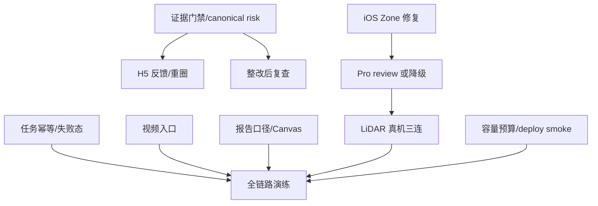

# 全国总决赛冲刺路线图

> 基线：`feat/anjushouhu-mvp@eb2d909`
> 原则：优先提升“首个价值结果速度、可信度、可恢复性、可重复演示”；不做大重构，不把尚未真机/真实样本验证的能力包装成已完成。

## 0. 实施进度

- **2026-08-06：P0-A 已完成。** 结果错误优先展示；同房间活动 job 幂等复用；未知 worker 异常安全失败；重启时原子恢复 job/room/assessment；H5 使用无重叠轮询并由服务端 stage 驱动。
- 验证结果：Python 58/58、React 33/33、TypeScript/Vite production build、产品文案检查全部通过。
- 未改变 API 路径、数据库 Schema 和环境变量；`start_analysis` 响应只新增兼容字段 `reused`。

## 1. 总体策略

总决赛前只保一条主演示链路：

```text
H5 显式 Demo/预演环境
→ 照片质量
→ 原图风险框
→ 评分与覆盖度
→ A/B/C
→ 选择 B
→ 清晰预算与分享报告
```

iOS 游园会 AR 是高上限增强项。只有在完成真实 Pro review 语义和 LiDAR 真机连续三次验收后，才升级为主演示；否则作为“空间定位技术加演”，风险保持待确认、不计正式分。

## 2. 路线图任务总表

### P0：必须保证演示闭环

| 任务名称 | 用户问题 | 当前代码位置 | 修改范围 | 推荐实现 | 工作量 | 风险 | 验收标准 | 展示价值 | 优先级依据 |
|---|---|---|---|---|---:|---|---|---|---|
| 结果/任务可靠性包 | 异常时永久加载、重复分析、重启后 room 残留 analyzing | `App.tsx:691-801`；`assessment_service.py:58,196-210,724-795` | Web/后端 | error 优先；job 幂等；全异常收口；启动状态恢复；单轮询 | M | 状态迁移回归 | 不卡死、不重复 job、重启后状态一致、都可重试 | 高 | 直接阻断结果揭晓 |
| 正式证据门禁与 canonical 去重 | 分数可能无位置证据或重复扣分 | `assessment_service.py:724-949`；`scoring.py:47-58` | 后端/AI契约 | `score_eligible` + evidence group + 保守归并 | L | 误合并/漏计 | 每个计分风险有证据；同物理风险只扣一次 | 高 | 决定可信度 |
| 接通本地视频入口 | 点击视频却进入实时相机 | `App.tsx:406-411,652-659`；`content.ts` | Web | 创建 `video_frame` assessment；相机入口独立 | S | 文案/恢复回归 | 真实进入 3—6 帧预览，原视频不上传 | 高 | 当前 PRD 断点 |
| Provider 容量、时延与质量状态 | 多图/多人会无界等待；临时超时会永久判废照片 | `assessment_service.py:143-181,358-382`；`api.ts:18-37` | Web/后端/AI | 异步/轻量 quality；可重试状态；队列超时；fetch 预算 | L | 状态契约/429/费用 | 3 图、2 用户进入约定 SLA；模型失败不等于图片不合格；满载可恢复 | 高 | 最易让评委失去耐心并阻断主链路 |
| 报告选择与预算口径 | 未选 A/B/C 混入整改清单 | `assessment_service.py:268-317`；`App.tsx:995-1084` | Web/后端 | 已选清单与待选择建议分区；总计一致 | S | 兼容旧报告 | 选择、预算、预计分、分享图四处一致 | 高 | 最强展示页当前有歧义 |
| iOS Pro 或诚实降级 | Turbo 被当正式复核结果 | `RemoteAnalysisClient.swift:72-107`；`assessment_service.py:487,616-659` | iOS/后端/AI | 真 Pro review；否则 manual check 不计分 | L | 现场时延/模型配额 | Pro 后才计分，或明确无正式分 | 高 | 防止核心技术口径失真 |
| 真机/弱网/真实模型门禁 | 自动测试不能证明现场稳定 | `docs/DEVICE_TEST_RECORD.md`；部署配置 | QA/部署/全端 | 10 次 H5、3 次 iOS、故障注入和回滚演练 | M | 需要设备/授权素材 | 连续成功并记录 release/设备/网络/耗时 | 高 | 总决赛交付的最终门槛 |
| 一键示例体验 | 评委没有合适家庭照片，真实模型失败就中断 | `HomePage`、Demo Provider/fixture、路由 | Web/后端/部署 | 独立 `#/demo` 或“体验示例”；全程明显 Demo；默认关闭/受控开启 | M | Demo 污染正式数据 | 1 次点击进入固定高质量链路，任何页面可辨识 Demo | 极高 | 3—5 分钟体验必须可控 |

### P1：提高完整度和可信度

| 任务名称 | 用户问题 | 当前代码位置 | 修改范围 | 推荐实现 | 工作量 | 风险 | 验收标准 | 展示价值 | 优先级依据 |
|---|---|---|---|---|---:|---|---|---|---|
| H5 风险纠错 | 误报/框偏时无操作 | `api.ts:86-87`；`App.tsx:823,848` | Web/后端 | 不是风险、已整改、位置不准 + 最小重圈 | M | 分数状态回归 | 反馈持久化并即时重算 | 高 | 评委高频追问 |
| 报告长图安全尺寸 | 多房间 Safari 可能 Canvas 失败 | `App.tsx:995-1084` | Web | 安全上限、真实文本高度、分页/多图 | M | 分享兼容 | 20+ 项不裁切，Safari 可分享 | 高 | 分享是记忆点 |
| 分享链接收口 | 后端 token 链接打开回首页 | `assessment_service.py:319-332`；路由/API | Web/后端 | 补只读 SharePage，或明确只承诺图片分享 | S | 隐私/过期态 | 链接可读且不泄露原图，或无残留承诺 | 中 | 消除半成品 |
| 当前发布状态单页 | 文档对 Turbo/Pro/部署互相矛盾 | `README.md`、`docs/*STATUS*` | 文档/发布 | 以 release SHA 为唯一 current-state 表 | XS | 历史信息丢失 | 真实/Mock/已验/待验一页一致 | 中 | 提升答辩可信度 |
| Provider deploy smoke | health 只看密钥存在 | `asgi.py:119-131`、部署文档 | 后端/部署 | 受保护受控 fixture probe + last success | S | 模型成本 | 上台前能发现密钥/模型/配额错误 | 中高 | 降低隐藏故障 |
| 长相机会话完成态 | 30 次调用后画面继续但建议静默停止 | `App.tsx:292-299` | Web | 显示预算完成态；停止循环；保存代表帧/结束/重开 | XS | 状态回归 | 达上限后有可理解、可操作的结束状态 | 中 | 防止评委误判 AI 卡死 |
| 受保护媒体会话缓存 | 同一原图跨页面重复下载和解码 | `hooks.ts:4-23`；`asgi.py:445-448` | Web | assessment 级 ref-count/TTL Blob 缓存 | S | URL 泄漏/内存 | 同图跨页复用；退出/删除后全部 revoke | 中 | 改善弱网与 Safari 压力 |

### P2：提高展示冲击力

| 任务名称 | 用户问题 | 当前代码位置 | 修改范围 | 推荐实现 | 工作量 | 风险 | 验收标准 | 展示价值 | 优先级依据 |
|---|---|---|---|---|---:|---|---|---|---|
| “AI 看见—规则判断—家庭行动”解释卡 | 评委可能以为只是模型生成文字 | P06/P07、score breakdown、rule ids | Web/后端 | 用现有结构化字段展示三段证据链，不新增自由文案模型 | S | 信息过载 | 30 秒能说明模型/规则/行动分工 | 极高 | 直接体现技术与行业深度 |
| 评分变化可视化 | 预计提升的规则依据不够直观 | P08/P09、`projected_score` | Web | 展示当前→预计区间、关联所选项、复查免责声明 | S | 误解为保证 | 所有数值与规则一致并标“预计” | 高 | 强化闭环记忆点 |
| 多房间家庭故事样例 | 单卫生间像单点能力 | Demo fixture、P03/P09 | Web/fixture | 2—3 房间受控示例，突出覆盖度而非堆风险 | M | 报告过长 | 3 分钟内完成、报告仍清晰 | 高 | 回应“产品完整度”反馈 |
| 已验证的 iOS 空间回看 | AR 风险点难以在报告中复述 | iOS map/report | iOS | 仅在 Pro/真机门禁后展示 Zone 与空间证据 | L | 稳定性 | 三次真机无漂移/误合并后开放 | 极高 | 技术冲击力最高但有前置依赖 |

### P3：决赛后产品化

| 任务名称 | 用户问题 | 当前代码位置 | 修改范围 | 推荐实现 | 工作量 | 风险 | 验收标准 | 展示价值 | 优先级依据 |
|---|---|---|---|---|---:|---|---|---|---|
| 授权评测集与指标体系 | 无法量化模型效果 | Provider/analytics/tests | 数据/AI | 分风险正负样本、召回/误报/IoU/重复率 | XL | 数据授权 | 可复现指标与版本对比 | 中 | 长期可信度基础 |
| 整改后复查 | 预计提升不能被真实确认 | v2 model/report | 全栈/AI/规则 | Reassessment DTO、前后证据、状态机 | XL | 风险匹配复杂 | 复拍确认后才恢复分数 | 高 | 完成长期产品闭环 |
| H5/Service 局部拆分 | 大文件降低迭代速度 | `App.tsx`、`AssessmentService` | Web/后端 | 按页面/hook/use case 拆分，保持契约 | L | 回归范围大 | 现有视觉/API/测试无回归 | 低 | P0 稳定后再整理 |
| 城市价格/PDF/家庭协作 | 参考价和分享能力有限 | price/report/domain | 全栈 | 按真实需求逐项产品化 | XL | 范围膨胀 | 各自有数据来源和独立验收 | 中 | 不影响当前决赛 |

## 3. P0 实施细化：必须保证演示闭环

### P0-A — 结果揭晓与分析任务可靠性包

| 字段 | 内容 |
|---|---|
| 用户价值 | 任何网络/模型异常都能给出明确状态并恢复，不会卡死或重复扣费 |
| 对应页面 | P05、P06 |
| 影响组件 | `frontend/src/App.tsx`、`frontend/src/api.ts`、`backend/app/assessment_service.py` |
| 依赖 | 无外部依赖 |
| 预计工时 | 1—1.5 人日 |
| 测试重点 | 结果 401/404/500/超时；重复 `:analyze`；未知异常；服务重启后的 running job 与 room 状态 |
| 验收标准 | 结果错误页可达；同房间只有一个活动 job；所有 worker 异常最终进入 failed；重启后 room 不残留 `analyzing`；重试复用或创建可追踪新 job |
| 风险 | catch-all 不得把密钥、堆栈暴露给用户；幂等逻辑要保留重新分析能力 |
| 是否直接提升体验 | 是，显著提升现场可恢复性 |

实施要点：

- `ResultPage` 先判断 error，再判断 loading/`!result`。
- `start_analysis()` 查询 room 最新 queued/running job 并直接返回。
- `_analyze()` 最外层安全捕获未知异常、写 failed、记录 request/job id。
- 启动恢复用同一事务把遗留 job 置为 `interrupted`，并把关联 room/assessment 迁移到可重试失败态；不要只更新 jobs 表。
- polling 改为单请求递归，UI stage 以服务端状态为主。

### P0-B — 正式风险证据门禁与 canonical 去重

| 字段 | 内容 |
|---|---|
| 用户价值 | 每一分都能指向证据，同一物理问题不会因为多拍几张而重复扣分 |
| 对应页面 | P06、P07、P09；视频/相机/iOS 共用 |
| 影响组件 | `assessment_service.py`、`scoring.py`、风险 DTO/测试 |
| 依赖 | 现有 media metadata、规则库 |
| 预计工时 | 1.5—2.5 人日 |
| 测试重点 | region null/非法；同风险两照片；同视频相邻/视角变化；不确定合并；用户反馈后重算 |
| 验收标准 | 无可追溯证据不进入正式扣分；每个计分风险有 `canonical_risk_id` 或等价证据组；同一物理风险只扣一次 |
| 风险 | 过度合并会吞掉独立风险，策略必须保守并可待确认 |
| 是否直接提升体验 | 是，直接提升可信度和评分解释 |

最小实现不要求通用视觉图匹配平台。先增加：

- `score_eligible` / `pending_manual_check`。
- `RiskEvidenceGroup` 最小字段：canonical id、evidence media ids、merge reason/version。
- 普通照片在无法确定是否同一物理风险时，不自动重复计完整分；交给用户确认。

### P0-C — 把视频入口真正接通，拆清“视频”和“实时相机”

| 字段 | 内容 |
|---|---|
| 用户价值 | 用户点到什么就得到什么；评委能实际验收已有视频抽帧能力 |
| 对应页面 | P01、P02、P04、底部中央相机 |
| 影响组件 | `HomePage`、`UploadPage`、集中式 Web 文案、路由测试 |
| 依赖 | 已有 `video.ts` 与 `input_mode=video_frame` API |
| 预计工时 | 0.5—1 人日 |
| 测试重点 | 照片入口、视频入口、刷新恢复、视频不上传原文件、失败回退照片 |
| 验收标准 | 首页“选择本地视频”创建 video assessment；P04 显示视频选择和 3—6 帧预览；中央相机仍只进入临时 H5 camera |
| 风险 | 不要同时增加复杂编辑器或长视频支持范围 |
| 是否直接提升体验 | 是，修复明显认知断裂 |

### P0-D — 多图上传时延与 Provider 容量预算

| 字段 | 内容 |
|---|---|
| 用户价值 | 3 张照片仍能在可预期时间内进入正式分析，两名用户不会互相无限阻塞；短暂模型故障不会要求重传正常照片 |
| 对应页面 | P04、P05 |
| 影响组件 | media upload、quality skill、Pro/Turbo semaphore、H5 fetch |
| 依赖 | 需确定方舟配额与演示并发上限 |
| 预计工时 | 1.5—2 人日 |
| 测试重点 | 3/6 图、2—3 并发用户、Provider 15/60 秒超时、队列满、取消、同一 media 幂等重试质检 |
| 验收标准 | 单图质量目标 ≤3 秒；3 图质量不线性达到 3 倍最坏耗时；Pro 等待有上限；Provider 失败记录为可重试系统态而非 `usable=false` 图片事实；恢复后无需重传即可继续 |
| 风险 | 引入异步质量状态会改变 media DTO/页面状态；盲目提并发会触发 429 或增加费用；不要扩多 worker 共享 SQLite |
| 是否直接提升体验 | 是，直接缩短第一结果时间 |

推荐顺序：先分开“文件保存状态、质量任务状态、成功的质量结论”。优选 `uploaded → quality_checking → usable/unusable/quality_failed_retryable`，上传写盘后立即返回并异步质检；若 3 天内不改异步契约，至少增加幂等 `retry quality` 和独立错误态。随后再把质量检查从正式 Pro 单通道隔离成轻量/批量路径；不要先简单把 semaphore 数量调大。

### P0-E — 报告只展示已选清单，补清晰预算总计

| 字段 | 内容 |
|---|---|
| 用户价值 | 家属一眼看懂“选了什么、多少钱、预计改善什么” |
| 对应页面 | P09、报告预览/分享 |
| 影响组件 | report DTO、`ReportPage`、`createReportImage()` |
| 依赖 | 现有 selected solutions 与 budget group |
| 预计工时 | 0.5—1 人日 |
| 测试重点 | 0/1/多项选择、同预算组复用、移除、未选风险、长文本 |
| 验收标准 | 整改清单正文只列 selected items；未选风险独立标为“待选择”；预算总计/材料/人工与 selected items 一致 |
| 风险 | 不要删除风险建议入口，只需分区和口径清楚 |
| 是否直接提升体验 | 是，提升最强分享页的可信度 |

### P0-F — iOS 路线二选一：补齐 Pro，或诚实降级

| 字段 | 内容 |
|---|---|
| 用户价值 | 不把 Turbo 临时候选冒充正式复核结果；四 Zone 切换稳定 |
| 对应页面 | iOS Zone 扫描、AR 标注、报告 |
| 影响组件 | `RemoteAnalysisClient`、fair API、CandidateReview、规则报告 |
| 依赖 | Ark Pro 模型、配额、授权游园会素材、LiDAR iPhone |
| 预计工时 | Pro 最小闭环 2—3 人日；诚实降级 0.5—1 人日 |
| 测试重点 | Zone 在途切换、Turbo/Pro 超时、无深度、不同物理同类风险、同物理跨帧 |
| 验收标准 | 路线 A：Pro 可确认/拒绝/合并/修正后才计分；路线 B：未复核全部 manual check、无正式参考分 |
| 风险 | 不要为了赶时间把确定性同 risk_code 合并改名成 Pro |
| 是否直接提升体验 | 是，决定 iOS 是否可做主演示 |

同时修复：请求前捕获 `requestZone`；Turbo 使用 turbo capacity lane；日志不再写 Direct Pro。

### P0-G — 真机、真实模型、弱网与现场演练门禁

| 字段 | 内容 |
|---|---|
| 用户价值 | 把“能编译”变成“现场能连续成功” |
| 对应页面 | 全链路 |
| 影响组件 | H5 Safari/Chrome、生产 Provider、LiDAR iPhone、部署/监控 |
| 依赖 | 目标设备、授权素材、生产额度、两名测试者 |
| 预计工时 | 1—2 人日集中执行；发现问题另计 |
| 测试重点 | 见 `FINAL_ROUND_TEST_CHECKLIST.md` |
| 验收标准 | H5 照片链路连续 10 次成功；iOS 四 Zone 连续 3 次成功；弱网与超时均可恢复；演示脚本和回退脚本经过计时 |
| 风险 | 这是外部验收，不能用单元测试替代 |
| 是否直接提升体验 | 是，最高优先级 |

### P0-H — 一键示例体验

| 字段 | 内容 |
|---|---|
| 用户价值 | 评委不准备照片也能在 1 次点击后看到完整高质量结果；真实模型异常时仍能完成产品讲解 |
| 对应页面 | P01—P09 |
| 影响组件 | HomePage、独立 Demo route、fixture、Demo banner、部署开关 |
| 依赖 | 现有显式 Mock Provider 与仓库授权素材 |
| 预计工时 | M（0.5—1.5 人日） |
| 测试重点 | Demo 与正式会话隔离、刷新恢复、所有页标识、生产默认关闭、分享图标识 |
| 验收标准 | 首页有“体验示例”；无需上传即可走完风险框、A/B/C 和报告；API/页面/报告都能识别 Demo；不进入真实效果指标 |
| 风险 | 绝不能根据 Provider 失败隐式切 Demo，也不能把 fixture 结果说成现场识别 |
| 是否直接提升体验 | 是，评委 3—5 分钟体验的最高收益项 |

## 4. P1 实施细化：提高完整度和可信度

### P1-A — H5 风险纠错最小闭环

| 字段 | 内容 |
|---|---|
| 用户价值 | 用户可否认误报、标记已整改、修正位置，分数随反馈更新 |
| 对应页面 | P07、P06、P09 |
| 影响组件 | RiskPage、RiskOverlay、feedback/region API |
| 依赖 | P0-B 证据状态 |
| 预计工时 | 1—1.5 人日 |
| 测试重点 | confirmed/not risk/already resolved/location inaccurate、刷新恢复、评分更新 |
| 验收标准 | 三个反馈按钮 + 重圈保存；每次反馈持久化并刷新分数；VoiceOver 名称完整 |
| 风险 | 不做自由问答/语音圈选，先做确定性反馈 |
| 是否直接提升体验 | 是，解决评委高频追问 |

### P1-B — 报告长图安全尺寸与分享策略

| 字段 | 内容 |
|---|---|
| 用户价值 | 多房间报告在 iOS Safari 也能稳定预览/分享 |
| 对应页面 | P09 分享 |
| 影响组件 | Canvas renderer、Web Share/下载 |
| 依赖 | P0-E |
| 预计工时 | 1—1.5 人日 |
| 测试重点 | 1/6 房间、长标题、20+ 项、Safari canvas 上限、分享取消 |
| 验收标准 | 设置安全尺寸；超过上限分页/多图；文本不重叠；取消分享不报错 |
| 风险 | 不要临赛改成复杂 PDF 服务 |
| 是否直接提升体验 | 是 |

### P1-C — 只读分享链接或明确删除兼容入口

| 字段 | 内容 |
|---|---|
| 用户价值 | 分享给家人可以真正打开，或产品口径只承诺图片分享 |
| 对应页面 | P09、SharePage |
| 影响组件 | share API、HashRouter、只读报告 |
| 依赖 | 安全/隐私复核 |
| 预计工时 | 0.5—1 人日 |
| 测试重点 | token 过期、撤销、无 auth、原图不泄露、刷新/深链 |
| 验收标准 | `/#/share/{token}` 可读且过期态友好；若不做，移除未使用路径并统一文档 |
| 风险 | 不要在分享页暴露 media/content 或 analytics |
| 是否直接提升体验 | 中高 |

### P1-D — 当前版本单页与演示口径收口

| 字段 | 内容 |
|---|---|
| 用户价值 | 队员和评委听到同一套真实状态，不被历史文档绕晕 |
| 对应页面 | 文档/答辩 |
| 影响组件 | README、IMPLEMENTATION_STATUS、DEVICE_TEST_RECORD、部署记录 |
| 依赖 | P0 完成情况 |
| 预计工时 | 0.5 人日 |
| 测试重点 | commit、生产 asset、功能开关、Mock/真实边界、未验证项 |
| 验收标准 | 首屏一张 current-state 表，无相互矛盾的“已部署/未部署”“Turbo/Pro”表述 |
| 风险 | 不删除历史，只把历史移到日期记录区 |
| 是否直接提升体验 | 间接，但提升答辩可信度 |

### P1-E — 最小可观测性与部署 smoke

| 字段 | 内容 |
|---|---|
| 用户价值 | 上台前能发现密钥、配额、队列、数据库与静态资源问题 |
| 对应页面 | 运维，不新增用户页面 |
| 影响组件 | analytics、deploy smoke、health status |
| 依赖 | 生产凭据与受控 fixture |
| 预计工时 | 1 人日 |
| 测试重点 | provider probe、last success、p50/p95 latency、capacity busy、DB restart |
| 验收标准 | 一条命令跑完受控 P01—P09 API smoke；输出不含密钥/原图/完整档案；有明确 release SHA |
| 风险 | 外部 `/health` 不应每次调用收费模型 |
| 是否直接提升体验 | 间接，但显著降低现场事故 |

### P1-F — 长相机会话有明确完成态

| 字段 | 内容 |
|---|---|
| 用户价值 | 相机达到调用预算后不会无声“假运行”，用户知道下一步该保存、结束还是重新开始 |
| 对应页面 | H5 实时相机 |
| 影响组件 | `CameraPage` 会话状态、集中式文案、相机测试 |
| 依赖 | 无 |
| 预计工时 | 0.25—0.5 人日 |
| 测试重点 | 第 29/30/31 次、在途请求完成时达限、离页清理、重新开始是否显式重置 |
| 验收标准 | 达限后停止调度并播报完成状态；保存代表帧/结束/重新开始均可用；不会隐式继续计费 |
| 风险 | 不能把“临时建议完成”说成正式检查完成 |
| 是否直接提升体验 | 是 |

### P1-G — 受保护媒体的会话级复用

| 字段 | 内容 |
|---|---|
| 用户价值 | 在结果、风险和方案之间切换时原图立即可见，弱网下不反复下载 |
| 对应页面 | P04、P06、P07、P08 |
| 影响组件 | `useProtectedImage`、assessment session lifecycle |
| 依赖 | 现有 token 授权 |
| 预计工时 | 0.5 人日 |
| 测试重点 | 多组件同时引用、路由切换、abort、token 失效、删除 assessment、10 次流程内存 |
| 验收标准 | 同一 path 在有效会话内只发起一次在途请求并安全复用；最后引用/会话结束按策略 revoke；不写 Cache Storage/localStorage |
| 风险 | 不得把私有媒体做跨用户或持久化浏览器缓存；必须限制条目/字节数 |
| 是否直接提升体验 | 是，尤其弱网和 Safari |

## 5. P2/P3 实施说明

P2 只在 P0/P1 冻结后做“评委看得见”的增强：

- **P2-A 解释卡（S）**：P07 用现有 evidence、rule、score breakdown 展示“AI 看见什么 → 规则如何判定 → 家庭下一步做什么”。验收以评委 30 秒内能复述三层分工为准。
- **P2-B 评分变化可视化（S）**：P08/P09 把所选方案与预计提升区间绑定，显式说明复查前不是最终分。所有数值仍来自规则。
- **P2-C 多房间故事样例（M）**：显式 Demo 提供 2—3 房间，突出覆盖度、优先级和统一预算；限制风险数量，避免报告变成长清单。
- **P2-D iOS 空间回看（L）**：只在 Pro/待确认语义、LiDAR 三连和弱网门禁通过后开放；否则不排入决赛版本。

P3 决赛后再推进：

- **P3-A 授权评测集与指标（XL）**：分 risk code 建正负样本，报告召回、误报、定位可用率/IoU、重复率、待确认率；禁止把 Demo fixture 当模型指标。
- **P3-B 整改后复查（XL）**：增加 Reassessment DTO/API、前后证据映射和状态机；已完成待复查不自动满分，复拍确认后才解决。
- **P3-C 局部可维护性重构（L）**：功能冻结后拆 `App.tsx` 页面/hook/report renderer 与 Service use case；不改变 UI/API。
- **P3-D 城市价格、PDF、家庭协作（XL）**：逐项立项并为价格来源、隐私和权限单独验收，不打包进决赛冲刺。

## 6. 3 天冲刺安排

### Day 1 — 不再卡死、不再重复跑

- 修 P0-02 结果错误顺序。
- 完成 start analysis 幂等、catch-all、僵尸 job 与关联 room/assessment 一致恢复。
- 改单请求轮询与真实 stage。
- 补 Python/React 失败态测试。

### Day 2 — 证据、视频、报告口径

- region null 不计分；canonical risk 最小结构。
- 接通 `video_frame` 用户入口，拆清实时相机文案。
- 报告仅列已选清单并补预算总计。
- 为 3 图/2 用户设置容量等待预算；质量失败与图片不合格分离，并支持同一 media 重试。

### Day 3 — 真机与发布演练

- Safari/Chrome、HEIC/旋转、横竖视频、弱网/刷新。
- iOS 先修 Zone 竞态、Turbo lane/文案；决定补 Pro 或降级。
- 从固定 commit 构建候选，执行全门禁、10 次 H5 演示、3 次 iOS 演示（若纳入主演示）。
- 冻结演示素材、讲稿、生产/离线回退路径。

## 7. 7 天冲刺安排

| 天数 | 工作包 | 依赖 |
|---|---|---|
| 1—3 | 完成上述 3 天 P0 | 无 |
| 4 | H5 风险反馈/重圈最小闭环 | P0-B |
| 5 | iOS Pro review 或完整诚实降级；真机四 Zone | Provider/设备 |
| 6 | 长图安全尺寸、分享策略、deploy smoke | P0-E |
| 7 | 全队连续演练、混合并发压力、故障注入、口径与文档冻结 | 全部 |

## 8. 14 天冲刺安排

| 阶段 | 工作包 | 输出 |
|---|---|---|
| Day 1—7 | 7 天版本 | 可现场演示、可回退的 release candidate |
| Day 8—10 | 授权评测集与模型/阈值校准 | 分风险效果表、误报/漏报/定位/重复率 |
| Day 11—12 | H5 局部拆分 + 浏览器 E2E | 稳定页面边界和自动主链路 |
| Day 13 | 整改后复查最小 API/页面或明确后延 | 真实可运行闭环，不做静态假页 |
| Day 14 | 冻结、回滚演练、答辩材料 | release SHA、镜像 digest、测试记录、演示录屏 |

## 9. 可并行与依赖关系



可并行：

- Web：结果错误、视频入口、报告口径。
- Backend：job 幂等、证据门禁、容量预算。
- iOS：Zone 竞态、Turbo/Pro 语义、真机准备。
- QA/产品：固定素材、测试矩阵、讲稿、状态文档。

强依赖：

- H5 纠错依赖正式风险状态和证据门禁。
- 整改后复查依赖 canonical risk。
- iOS 正式评分依赖 CandidateReview。
- 真机三连必须在候选版本冻结后执行。

## 10. 现场演示专用预案

准备三层回退，且所有 Demo 明确标识：

1. **A 路径：生产真实 Provider** — 用于证明真实调用，素材可控、只跑一次关键结果。
2. **B 路径：显式 Demo Provider** — 主舞台保证 P01—P09 视觉与规则链路可重复；页面持续显示演示模式。
3. **C 路径：预生成录屏/报告图** — 断网、配额、设备权限失败时，用于继续讲完整价值，不伪装成实时结果。

上台前预热健康检查和静态资源；不要预先创建大量真实 assessment，也不要用真实家庭照片。

## 11. 主动放弃清单

总决赛前明确不做：

- 微服务、Kubernetes、多 worker、PostgreSQL 迁移。
- 大规模视觉改版、换路由/状态管理框架、重写 UIKit。
- 通用自主 Agent 框架、向量库、知识库问答。
- 自动施工报价、商品下单、家庭账号协作。
- 完整 PDF 服务、城市价格、全屋数字孪生。
- 没有证据状态支撑的“整改后分数自动恢复”。
- 为追求效果把 Mock 隐式混入生产，或把 Turbo 候选命名成 Pro 结果。

## 12. 成功标准

总决赛候选版本只有同时满足下列条件才冻结：

- H5 主链路连续 10 次完成，无永久 Loading、无重复 job、无控制台错误。
- 每个正式计分风险都有可追溯证据；相同物理风险不重复扣分。
- 3 张照片在目标网络下第一结果时间进入团队设定预算。
- 报告选中项、预算和预计提升完全一致。
- 视频 CTA 实际进入视频流；实时相机语义独立。
- 生产 `/health`、受控 Provider smoke、SQLite 重启持久化通过。
- 若演示 iOS：四 Zone 连续 3 次成功，且 Pro review/待确认边界真实。
- 讲稿明确说明：环境辅助筛查、非医疗/验收/施工报价、真实效果仍以授权评测为准。
