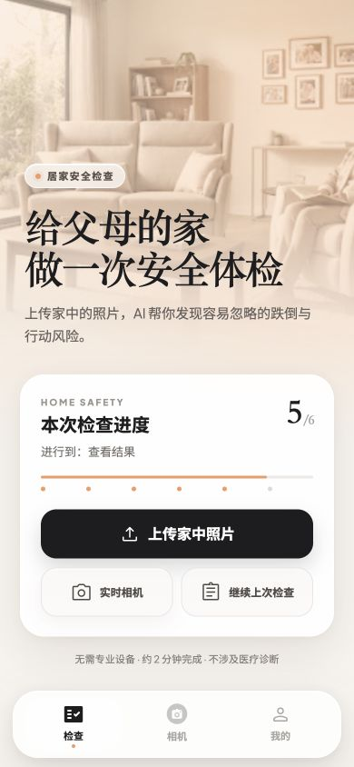
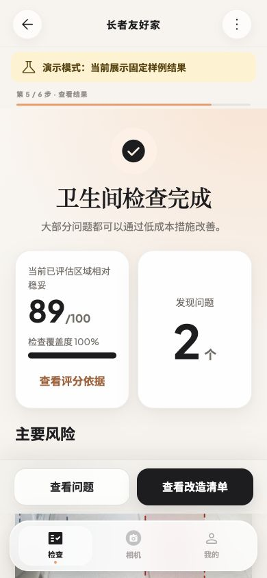
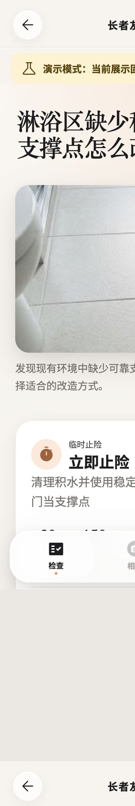
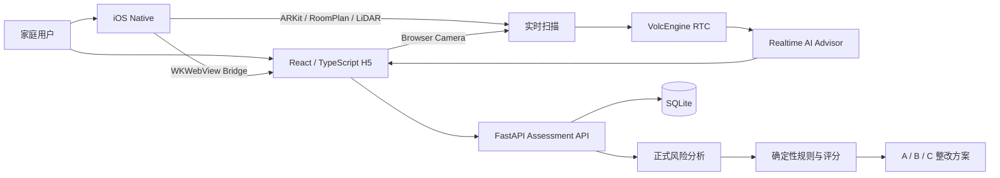

# AnjuGuard · 安心家 AI

> 🏆 **AI Hackathon 一等奖** · 面向适老化居住环境的多模态 AI 安全检查与整改辅助产品

**Multimodal AI · iOS / H5 · LiDAR / ARKit · RTC · FastAPI**

AnjuGuard 希望解决一个很具体的问题：家庭里很多对老人不友好的风险并不难发现，但从“看见问题”到“知道怎么改、先改什么、需要多少钱”，中间仍然需要大量人工判断。

项目把 **家庭环境采集 → 风险发现 → 结果确认 → 整改方案 → 预算清单** 串成一条完整产品闭环，并在支持设备上进一步探索基于 RoomPlan / LiDAR / ARKit 的实时空间扫描与 AI 顾问交互。

> AnjuGuard 不是医疗诊断、建筑验收、无障碍认证或施工报价工具。正式风险结果来自代表画面的重新分析与确定性规则，实时提示与 AR 锚点只作为扫描阶段的辅助信息。

---

## 为什么做这个项目

传统的居家适老化评估往往依赖专业人员现场检查。对普通家庭来说，真正困难的并不是“有没有风险”，而是：

- 哪些问题值得优先处理；
- 风险为什么重要；
- 有哪些不同成本档位的整改方式；
- 如何把一次检查继续变成后续行动。

AnjuGuard 的目标不是再做一个“上传图片后返回一段 AI 文本”的 Demo，而是把 AI 放进一个可执行的家庭改造流程中。

## 产品闭环

```text
创建家庭档案
  ↓
选择房间
  ↓
照片上传 / iOS 实时扫描
  ↓
AI 临时提示 + 扫描顾问
  ↓
代表帧重新分析
  ↓
风险结果与覆盖度
  ↓
A / B / C 整改方案
  ↓
结构化预算清单
```

### 核心能力

- **多房间适老化检查**：覆盖六类房间，支持每个房间 1–6 张照片与图像质量检查；
- **结构化风险结果**：输出二维风险区域、风险解释、确定性评分与独立覆盖度；
- **整改而不止识别**：为风险生成 A / B / C 三档整改方案、结构化价格与预算清单；
- **iOS 原生增强层**：原生拍照、实时扫描，以及支持设备上的 RoomPlan / LiDAR `spatial_ar`；
- **实时 AI 顾问**：H5 / iOS 通过 RTC 发布实时画面，顾问可结合当前房间上下文进行文字或语音交互；
- **安全降级**：RTC 故障自动回退 HTTP 临时检查，不影响正式风险分析；
- **移动端工程约束**：根据 RTC 上行、AR 帧率与设备热状态自适应降载，压力下从 720p / 15fps 降至 540p / 10fps，同时保留 AR 建图。

## 产品截图

<p align="center">
  
  
  
</p>

## 系统架构



## 技术栈

| 层 | 技术 |
|---|---|
| Web | React, TypeScript |
| Backend | FastAPI, Uvicorn, SQLite |
| iOS | Swift, WKWebView, ARKit, RoomPlan |
| Realtime | VolcEngine RTC, external NV12 video frames |
| AI interaction | Function Calling, room-level conversation context |
| Testing | Python unittest, Vitest, Swift Test, xcodebuild |

## 统一用户旅程

- iOS 启动后以持久化 `WKWebView` 加载线上 H5，P01–P09、相册上传、分析、方案和报告由 H5 承担；
- 原生层负责房间单张拍照与中央相机实时扫描；
- 扫描前在 H5 选择房间并创建 / 复用 room；
- 扫描页内可与能看到当前 RTC 画面的 AI 适老顾问进行文字或语音对话；
- 扫描结束上传代表帧后启动正式分析；家庭档案未完成时先补档，再自动续传分析；
- 支持 RoomPlan / LiDAR 的设备使用 `spatial_ar`，其他 ARKit 设备降级为 `camera_2d`，不生成虚假空间锚点。

## 可靠性与产品边界

- 实时建议和 AR 锚点不直接计入正式风险结果；
- RTC 顾问全局最多 8 个席位，额外请求进入 FIFO 排队；
- 同一房间 90 秒租约内只允许一个设备实时连接；
- App 只接受受信 HTTPS 主框架 Bridge；
- assessment token 仅存在于当次原生操作内存，不进入 URL、日志、UserDefaults 或 Keychain；
- RTC / LiDAR / 弱网 / VoiceOver / Dynamic Type 等真实设备能力仍需持续外部验证，自动测试通过不等于所有真实环境均已覆盖。

## 本地开发与测试

```bash
python3 -m venv .venv
.venv/bin/python -m pip install -r backend/requirements.txt
cd frontend && npm install && npm run build && cd ..
pod install
.venv/bin/python -m backend.app.server
```

```bash
cd Packages/AnjuCore && swift test
cd ../..
.venv/bin/python -m unittest discover -s backend/tests -v
cd frontend && npm run typecheck && npm test && npm run build
cd .. && python3 scripts/check_product_copy.py
```

iOS 无签名编译：

```bash
xcodebuild \
  -workspace "RASSAR App.xcworkspace" \
  -scheme "RetroAccess App" \
  -configuration Debug \
  -destination 'generic/platform=iOS' \
  -derivedDataPath /tmp/anjuguard-build \
  CODE_SIGNING_ALLOWED=NO \
  build
```

## 更多文档

- [实现状态](docs/IMPLEMENTATION_STATUS.md)
- [iOS 语音顾问](docs/IOS_VOICE_ADVISOR.md)
- [相机路线](docs/CAMERA_UPGRADE_ROADMAP.md)
- [隐私说明](PRIVACY.md)
- [Design QA](design-qa.md)

## 上游与许可

本项目基于 [UW Makeability Lab 的 RASSAR](https://github.com/makeabilitylab/RASSAR) 二次开发，并保留原始 MIT `LICENSE` 与版权声明。AnjuGuard 在此基础上扩展了适老化产品流程、H5 / FastAPI 链路、整改方案、实时顾问与 iOS 原生增强能力。