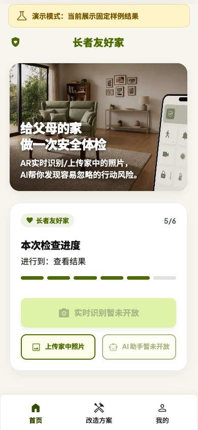
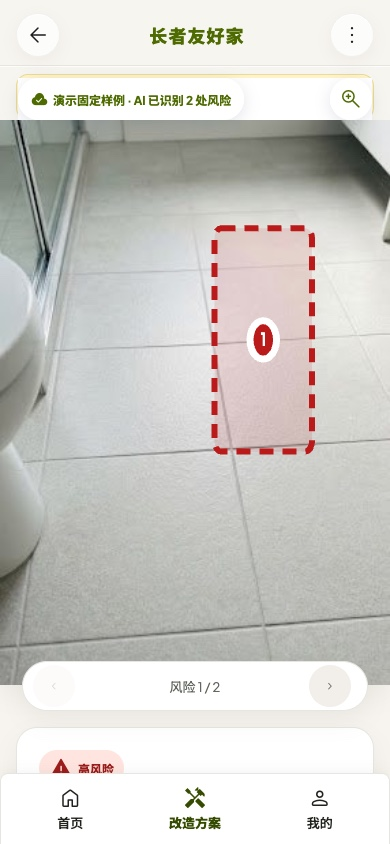
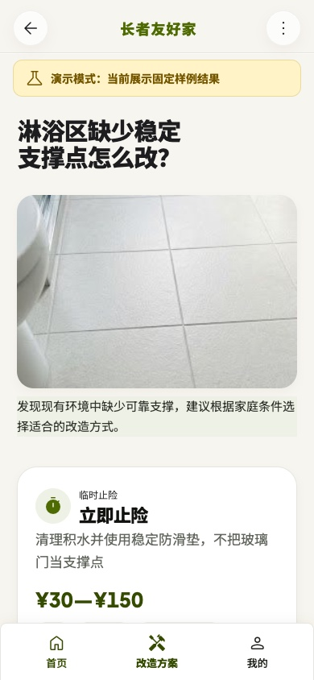
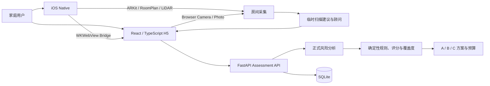

# AnjuGuard · 长者友好家

> 🏆 **抖音 AI 创变者计划 · 视觉搜索赛道 全国一等奖** · 面向适老化居住环境的多模态 AI 安全检查与整改辅助产品

AnjuGuard（长者友好家）帮助家庭把容易被忽略的跌倒、通行、支撑、照明与使用风险变得看得见、说得清，并进一步回答“先改什么、怎么改、需要多少预算”。

项目将 **家庭环境采集 → 风险发现与定位 → 用户确认 → A/B/C 整改方案 → 结构化预算与报告** 串成完整闭环；在支持设备上，还可使用 RoomPlan、LiDAR 与 ARKit 增强扫描阶段的空间定位和 AI 顾问交互。

<p align="center">
  
  
  
</p>

## 产品闭环

```text
创建家庭档案 → 选择房间 → 上传照片或实时扫描 → 保存代表画面
      → 正式风险分析与位置证据 → 确认问题 → 选择整改方案 → 预算与报告
```

## 核心能力

- **证据化风险检查**：覆盖六类房间和多张照片，先做媒体质量检查，再以 `bbox`、区域或空间证据定位画面中可见风险。
- **确定性结果**：风险等级、参考评分、覆盖度、去重和安全边界由版本化规则计算，不让模型自由给分。
- **从发现走向整改**：为每项风险提供 A/B/C 三档方案，价格来自结构化规则，并由代码汇总预算。
- **Web 主旅程与 iOS 增强**：React H5 承担完整评估流程；iOS 提供原生拍照、实时扫描和可靠深度下的临时空间锚点。

## 系统架构



| 层 | 主要技术与责任 |
|---|---|
| Web | React、TypeScript、Vite；负责照片、实时相机与完整用户旅程 |
| Backend | FastAPI、Uvicorn、SQLite；负责媒体、任务、Provider、规则和报告 |
| iOS | Swift、UIKit、WKWebView、ARKit、RoomPlan；负责原生采集与空间增强 |
| Domain | Swift Package `AnjuCore`；负责跨端领域模型与确定性规则 |
| Realtime | VolcEngine RTC 与 Function Calling；仅生成扫描阶段待确认提示 |

## 当前状态与边界

| 能力 | 当前状态 |
|---|---|
| 照片质量检查、风险定位、规则评分、覆盖度、A/B/C 方案、预算与报告 | 已实现并有自动测试；真实模型效果仍需授权评测集验证 |
| H5 实时相机与 iOS 原生采集 | 已实现代码并受功能开关控制；仍需 Safari、Chrome、WKWebView 和真机外部验证 |
| 实时视觉语音顾问与空间锚点 | Feature-gated；无可靠深度时降级为二维证据，不生成虚假锚点 |
| 整改后自动复查 | 规划中，尚未形成正式闭环 |
| H5 本地视频自动抽帧与正式识别 | 不在产品范围，也不作为比赛能力宣传 |

实时建议和 AR 锚点不直接计入正式结果。AnjuGuard 不是医疗诊断、建筑验收、无障碍认证、消防检查或施工报价工具；未拍摄区域不会被视为安全，规则价格也不等同于现场报价。

## 仓库结构

```text
apps/web/               React / TypeScript H5
apps/ios/               iOS App、Xcode 工程与 CocoaPods 配置
services/backend/       FastAPI 服务、规则、Provider 与测试
packages/AnjuCore/      Swift 领域层与单元测试
demos/                  比赛展示与视频工程
competition/            获奖项目说明与唯一 Skill 源码
docs/                   产品、架构、运维和质量文档
deploy/                 生产镜像、Compose 与 Caddy 配置
scripts/                仓库结构和产品文案校验
```

## 本地开发

需要 Python 3.13、Node.js 22；iOS 开发另需 Swift 6、Xcode 和 CocoaPods。

```bash
make setup
make test
```

分别启动 API 与 Web 开发服务：

```bash
make dev-api
make dev-web
```

iOS 依赖与无签名编译：

```bash
make ios-setup
make build-ios
```

其他统一入口可通过 `make check`、`make build-web` 和 `make docker-build` 执行。

## 文档

- [文档导航](docs/README.md)
- [实现状态](docs/product/implementation-status.md)
- [统一相机路线](docs/product/camera-roadmap.md)
- [iOS 视觉语音顾问](docs/architecture/ios-voice-advisor.md)
- [生产部署](docs/operations/production-deployment.md)
- [Design QA](docs/quality/design-qa.md)
- [隐私说明](PRIVACY.md)
- [开源许可](LICENSE)
- [第三方声明](THIRD_PARTY_NOTICES.md)

## 上游与许可

本项目基于 [UW Makeability Lab 的 RASSAR](https://github.com/makeabilitylab/RASSAR) 二次开发，并保留原始 [MIT 许可](LICENSE)与版权声明；其他依赖见[第三方声明](THIRD_PARTY_NOTICES.md)。AnjuGuard 在此基础上扩展了适老化产品流程、H5 / FastAPI 链路、确定性整改规则、实时顾问与 iOS 原生增强能力。
